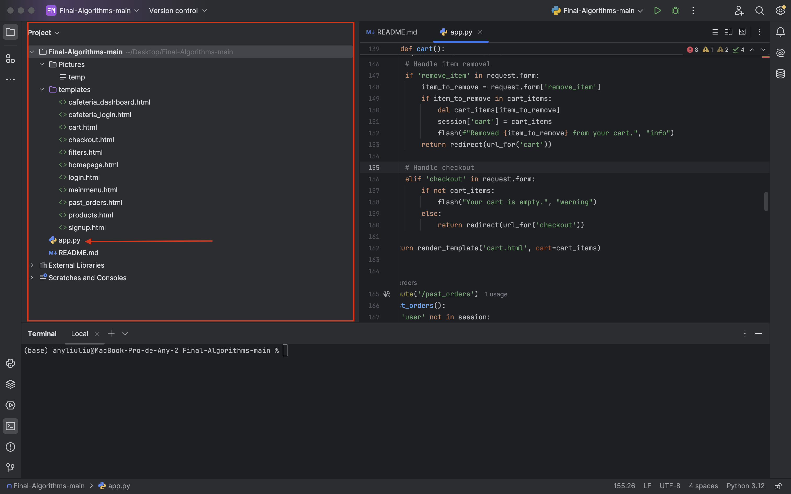
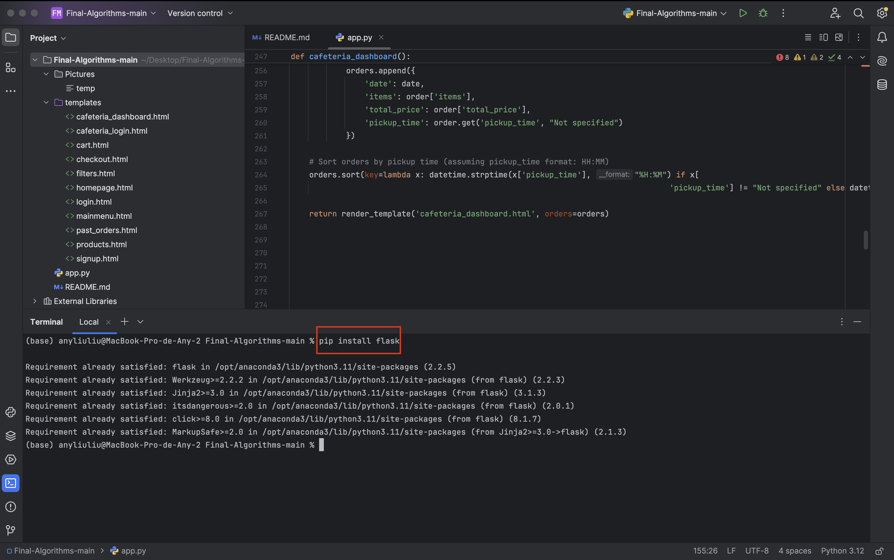
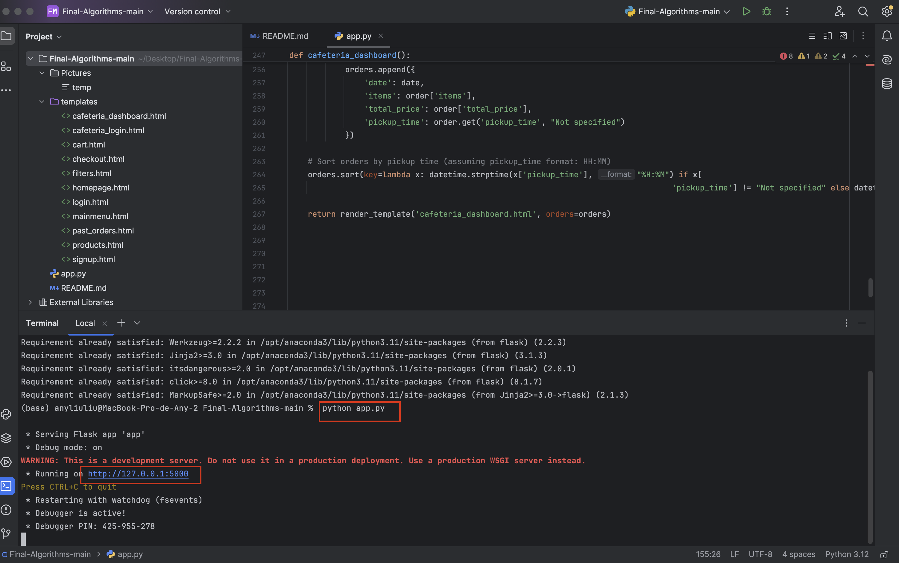
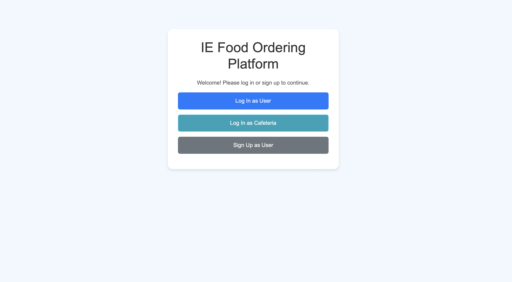
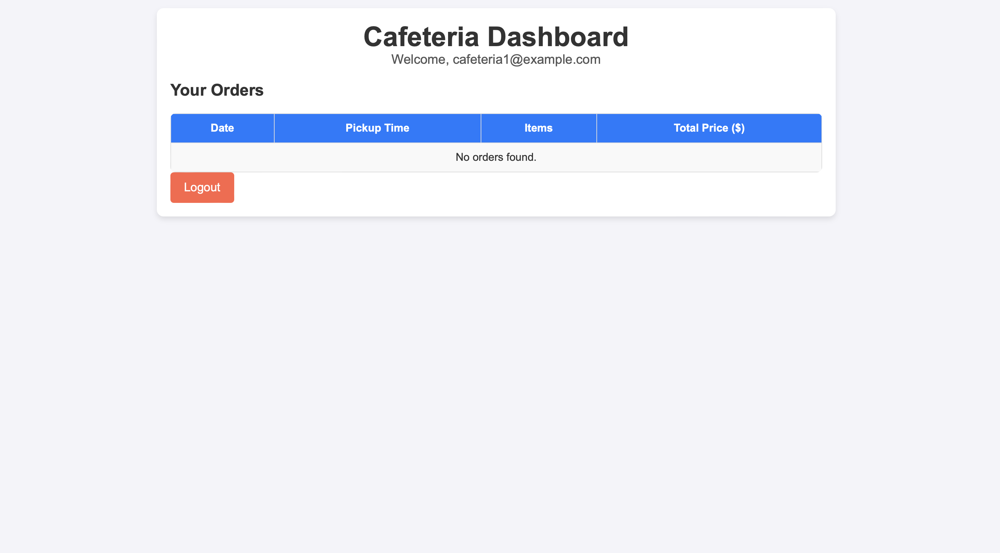

# Uni Coffee Order App

## Project Description
The Uni Coffee Order App was created to solve the problem of long lines and limited time during breaks at IE University. This app allows students to pre-order food and drinks, ensuring they can enjoy their breaks without the hassle of waiting in line.

## Key Features
- **Pre-Order System**: Place orders for food and beverages ahead of time.
- **Flexible Payment Options**: Accepts cash on pickup, PayPal, Apple Pay, and other payment options.
- **Optimal Pickup Locations**: Orders can be picked up from convenient locations within the IE Tower.
- **Real-Time Order Management**: Ensures orders are completed within a 30-minute window.
- **User-Friendly Interface**: Simple and intuitive design for easy navigation.

## Technologies Used
- **Python**: Core programming language for backend logic.
- **Dictionary Structures**: Manages products, shopping carts, and past orders.
- **Datetime Module**: Handles timestamps for orders and past orders.
- **Input/Output Handling**: Implements interactive features for user login, browsing, and checkout.
- **Development and Testing**: Created using Windows and tested on both macOS and Windows.
## Challenges and Learnings
**Challenges**

- Managing product categories and dynamically adding selected items to the cart.

- Handling user input validation to ensure a seamless experience.

- Simulating a real-world ordering system with Python dictionaries and logic.

***Future Enhancements***

- Develop a front-end interface for better usability (e.g., React or Flutter).

- Integrate with a database to persist user data and past orders.

- Add order notifications and tracking features.

- Implement a recommendation system for frequently ordered items.

***Why This Solution?***

This app was created to optimise the brief and precious time students have between classes. By enabling pre-orders and offering a streamlined pickup process, the Uni Coffee Order Project enhances the overall university experience. It also serves as a practical use case for applying Python programming skills to solve real-world problems.

## Installation
1. **Download the Zip File**: Save the folder to a known location on your computer.
2. **Recommended IDEs**: Use PyCharm or Visual Studio Code.
3. **Open the Folder**: Open the downloaded folder in your chosen IDE.
   
4. **View Project Structure**: On the left side of the screen, you will see all the elements inside the zip file.
    
5. **Run the Application**:
   - Open `app.py`.
   - In the terminal, install Flask if you don't have it: `pip install flask`.
   - Run the application: `python app.py`.
   - Click on the provided HTTP link to start using the program.
 
## Requirements
- **Operating Systems**: Windows 10, 11, macOS, Linux.
- **Python**: Version 3.6 or higher.
- **Libraries**: Flask.

## Usage

### Login or Sign Up
At the start, you will be asked whether you are a **buyer** or a **worker**.
 
#### Buyer
- You will be asked whether you want to log in or sign up.
  - **Login**: Enter your email and password. If they are correct, you will be logged in to the store.
  - **Sign Up**: Enter a new email and password to create an account.

#### Worker
- Enter your worker email and password. If they are correct, you will be logged in to the worker dashboard.

### Main Menu
Once logged in as a buyer, you will have access to the main menu with the following options:
- **Filters**: Filter products by category:
  - Breakfast
  - Lunch
  - Coffee
  - Snacks
 
- **Shopping Cart**: View the products in your cart.
  - If you haven’t added anything, it will tell you that your cart is empty.
  - You can view the items in your cart and the total price.
- **Past Orders**: View your past orders.
- **Checkout**: Proceed to pay for the products in your cart.
  - If you have products in your cart, you can proceed with checkout.
  - Choose a payment method: Apple Pay or PayPal.
  - Then, it will ask for the time you want to pick up your order.
  - The order will be placed, and the cart will be cleared after checkout.

For each category, you will be asked to enter the numbers of the products you want to add to your cart, separated by commas.

### Worker Dashboard
If you log in as a worker, you can access the admin dashboard where you can see the orders placed by buyers. You can choose to either view the orders or exit the dashboard.
 

### Future Impovements
- Enhanced User Experience: Use machine learning for personalized recommendations and add user reviews/ratings for informed choices.
- Advanced Order Management: Allow order modifications and exportable order history.
- Integration & Compatibility: Ensure cross-platform functionality (Android & iOS).

## Credits
This project was developed by **Team 6** members:
- Austin, Levi Singer
- Juzgado García-Aranda, Juan
- Liu, Any Wan Ying
- Montes, Pelayo Zalba
- Terry Sanz Pastor, Pedro
- Drake Saldaña, Miguel

Special thanks to **Professor Antonio López Rosell** for his guidance.
Program: Bachelor in Business Administration & Data and Business Analytics (BBA-DBA), Algorithms and Data Structures Course
Institution: IE University, Madrid, Spain
This project represents a culmination of teamwork, critical thinking, and programming skills to address real-world challenges faced by students. Thank you for supporting and engaging with our work!
